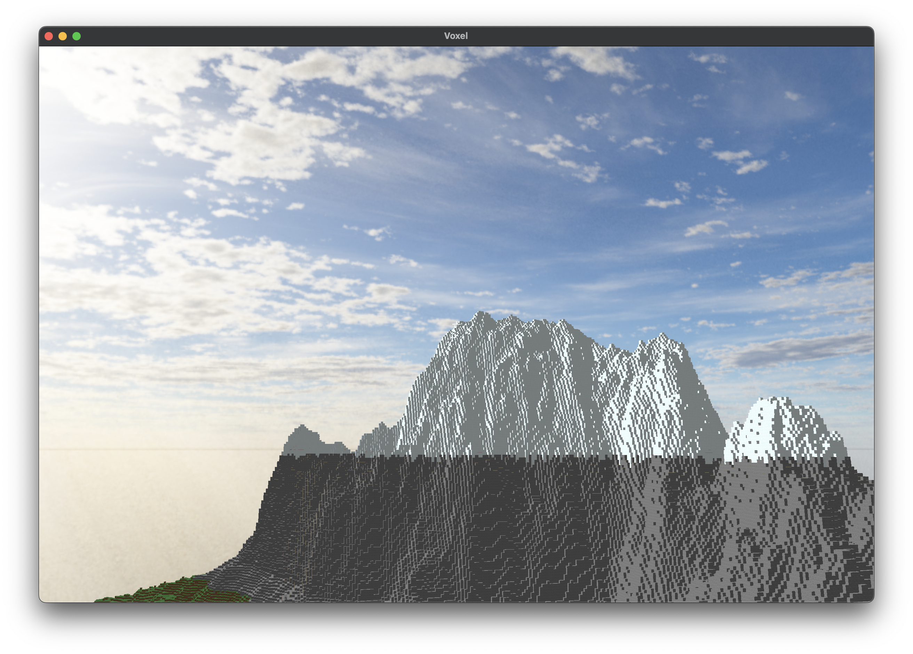
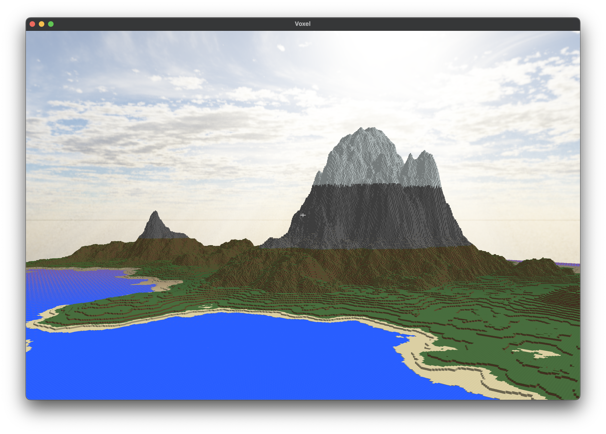
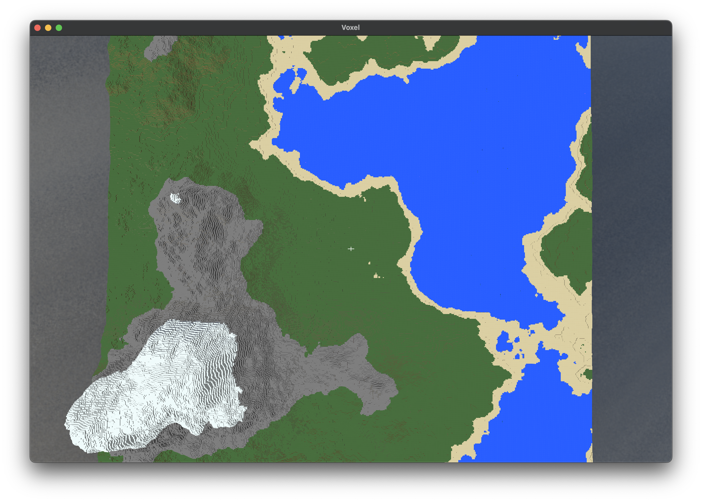

# Voxel Engine

A custom-built Minecraft-inspired (or basically, a clone) voxel game engine developed from scratch using OpenGL, with procedural terrain generation, basic lighting, and interactive world mechanics.



## About

This project is a lightweight voxel engine built without relying on third-party game engines. It implements a block-based 3D world with procedural terrain generation, dynamic lighting, and interactive gameplay using modern C++ and OpenGL.

## Features

- **Procedural World Generation**: Infinite terrain generation using Perlin Noise
- **Block-Based World**: Place and destroy different types of blocks
- **Dynamic Lighting System**: Sky light and block light propagation
- **Chunk-Based Rendering**: Efficient chunk loading and unloading
- **Water Rendering**: Special transparent block handling with alpha blending
- **Custom Sky Box**: Multiple sky texture options
- **Physics & Camera Controls**: First-person camera with movement physics
- **Interactive GUI**: Real-time parameter adjustment with ImGui
- **Multi-threaded Chunk Processing**: Utilizes a thread pool for background chunk generation
- **Optimized Mesh Generation**: Only visible faces are rendered, reducing vertex count by 99.54%
- **Efficient Memory Management**: Compact data structures for blocks and lighting
- **Custom Shader System**: GLSL shaders for various rendering effects
- **BitPacking for Vertex Data**: Optimized vertex format to reduce memory usage
- **Ray Casting**: Precise block selection algorithm
- **High Performance Rendering**: Able to handle large view distances
- **Performance Stability**: Stable 120 FPS, even with 32 chunks render distance

## Screenshots

*Cool snowy mountains*


*Toggleable GUI to modify many things in-game*


*Cool mountain with golden hour sky box*


*Cool mountain with blue sky box*


*Procedurally generated terrain with various block types*

## Building the Project

### Prerequisites

- C++20 compatible compiler
- CMake 3.8 or higher
- OpenGL 3.3+ support
- Clang 14 (I use this to compile the project, other compilers might work, or might not, though MSVC will probably not work because i dont add support for struct padding `#pragma push(pack, 1)` )

### Required Libraries

You need to install these libraries by yourself:
- GLFW3
- glm
- spdlog
- fmt

Other libraries such as FastNoiseLite, glad, etc is already on the source itself (`vendor/`)

### Building

1. Clone the repository:
```bash
git clone https://github.com/zKevz/voxel-engine.git
cd voxel-engine
```

2. Create a build directory:
```bash
mkdir build && cd build
```

3. Configure and build:
```bash
cmake ..
cmake --build .
```

4. Run the executable:
```bash
./voxel
```

## Controls

- **WASD**: Move around
- **Space**: Jump/Fly up
- **Left Shift**: Fly down
- **Mouse**: Look around
- **Left Click**: Break blocks
- **Right Click**: Place blocks
- **ESC**: Toggle cursor
- **F**: Toggle super fast crazy movement speed
- **R**: Toggle wireframe rendering
- **M**: Toggle GUI
